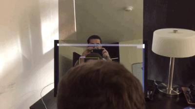
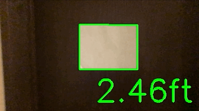
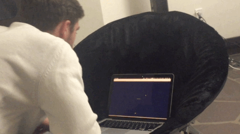
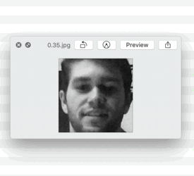
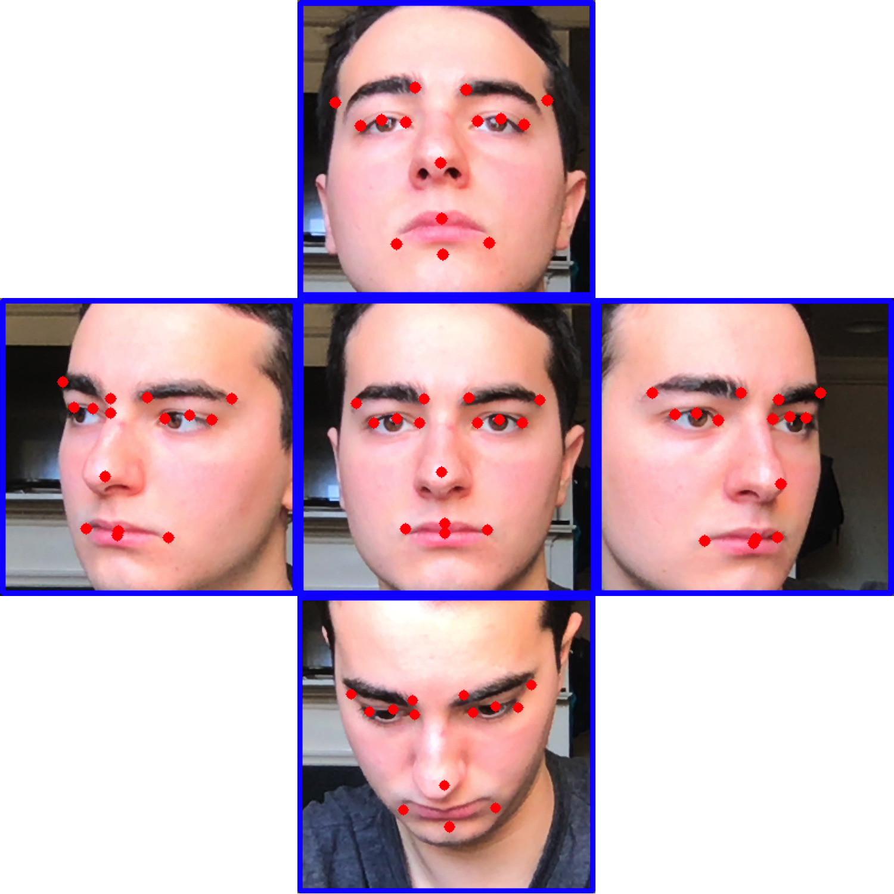
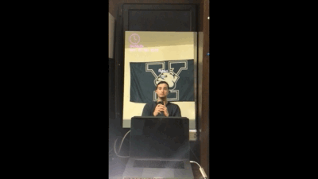

# AR Mirror
Jared Weinstein & Robert Gerdisch

## Setup:
```
git clone https://github.com/rgerd/ar-mirror.git
virtualenv venv
source venv/bin/activate
pip install -r requirements.txt
```

## Using the right python version:
### On macOS:
* [Install python 3.6.7](https://www.python.org/ftp/python/3.6.7/python-3.6.7-macosx10.9.pkg)
```
cd .../.../ar-mirror
rm -rf venv
virtualenv venv -p python3.6
source venv/bin/activate
pip install -r requirements.txt
```

## How it works:
### Use the height of the face in pixels to calculate some sort of relative distance:


[See code](https://github.com/rgerd/ar-mirror/blob/202c9d10596215fb9908a592d5335e0e058c4434/scripts/face.py#L43)

### Get the focal length of your camera by solving for it given known distances and measured pixel widths:


[See code](https://github.com/rgerd/ar-mirror/blob/202c9d10596215fb9908a592d5335e0e058c4434/scripts/rect_calibration.py)

### Relate your x and y coordinates in pixel space to x, y, and z coordinates in "real" space:


[See code](https://github.com/rgerd/ar-mirror/blob/202c9d10596215fb9908a592d5335e0e058c4434/scripts/face.py#L52-L53)

[See visualization](https://github.com/rgerd/ar-mirror/blob/202c9d10596215fb9908a592d5335e0e058c4434/scripts/mirror_viz.py)

### Train a facial recognizer on your faces:


[See code (1)](https://github.com/rgerd/ar-mirror/blob/202c9d10596215fb9908a592d5335e0e058c4434/scripts/face_dataset.py)

[See code (2)](https://github.com/rgerd/ar-mirror/blob/202c9d10596215fb9908a592d5335e0e058c4434/scripts/face_training.py)

[See code (3)](https://github.com/rgerd/ar-mirror/blob/202c9d10596215fb9908a592d5335e0e058c4434/scripts/ar_mirror.py#L99)

### Use a facial landmark neural network to find keypoints on the face:


### Use your nose point to determine face orientation:
</img>


[See code](https://github.com/rgerd/ar-mirror/blob/202c9d10596215fb9908a592d5335e0e058c4434/scripts/face_tracker.py)

### Put it all together to get a system you can nod at:


[See code](https://github.com/rgerd/ar-mirror/blob/master/scripts/ar_mirror.py)
